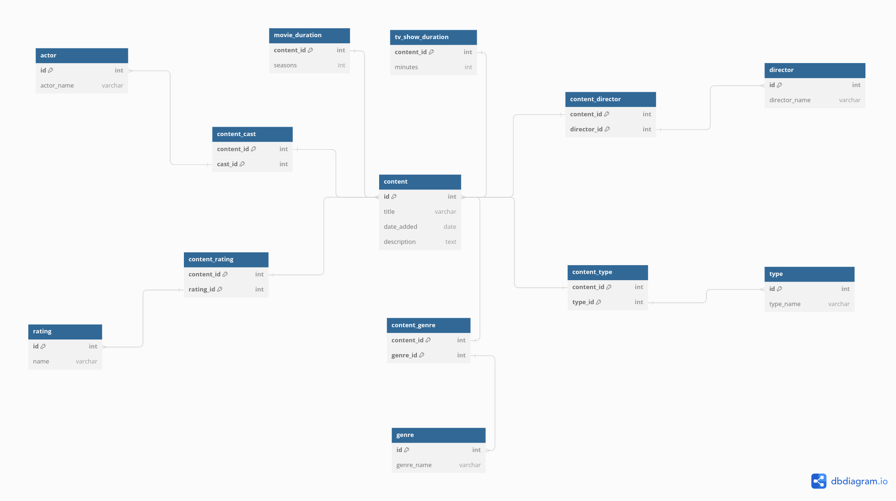

## Projeto final da disciplina de Banco de Dados

O conjunto de dados escolhido foi o [Netflix Movies and TV Shows](https://www.kaggle.com/datasets/shivamb/netflix-shows), um dataset que conta com mais de 8 mil filmes, séries e os demais tipos de mídia audiovisual disponível na Netflix.

Os dados vêm na forma de uma grande tabela, a partir de um arquivo *.csv*, e as informações nela contidas são transformadas em um banco de dados relacional e posteriormente migradas para o MySQL.

O modelo conceitual pode ser visto a seguir:

 Traduzindo para o modelo lógico:
 

O arquivo `data_cleaning.ipynb` é um jupyter notebook que abre o dado original "bruto", `netflix_titles.csv` e o separa em diversos DataFrames, visando separar as features e formar um banco de dados relacional. Cada DataFrame corresponde a uma tabela do banco modelado.
O arquivo `insert_on_db.ipynb` pega todos dos DataFrames gerados e os adiciona em um banco de dados no MySQL.

`data_cleaning.ipynb`:
- limpa os dados
- separa a tabela inicial em tabelas menores mas criando as relações
- salva cada uma dessas tabelas em arquivos `.csv`

`insert_on_db.ipynb`:
- abre cada um dos arquivos `.csv` gerados anteriormente
- insere cada dado desses arquivos no banco de dados relacional